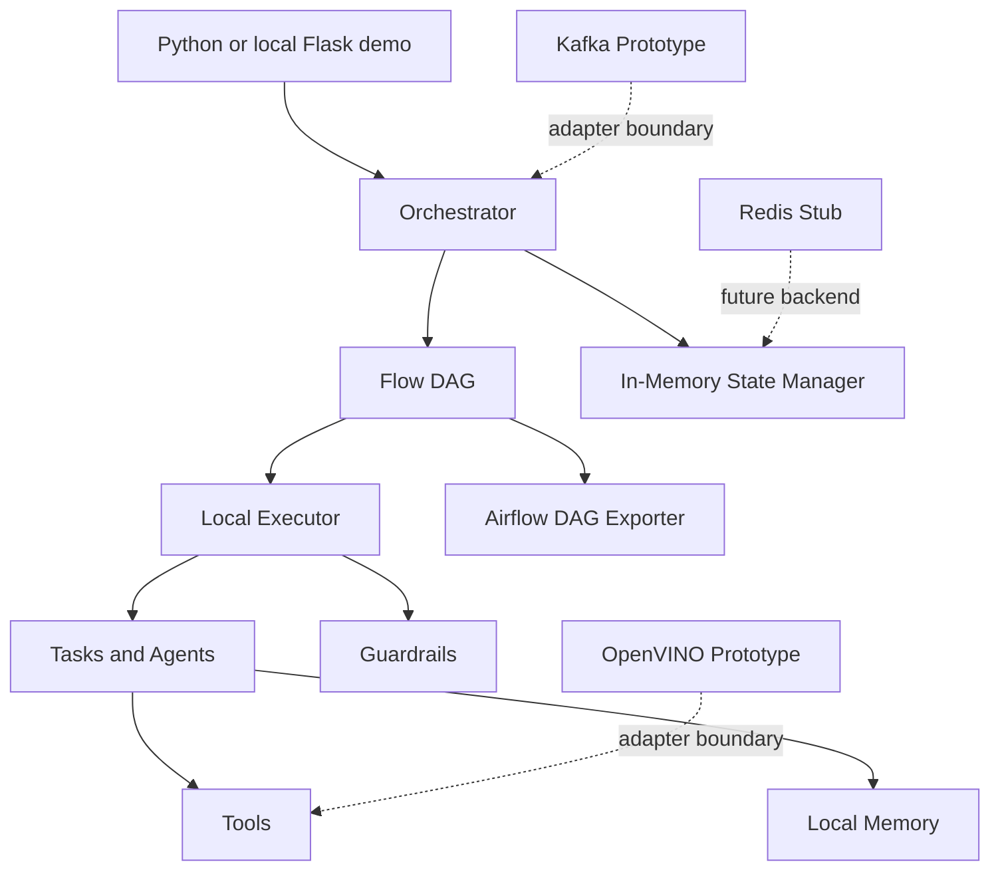

# AIWork

AIWork is an alpha-stage Python framework for experimenting with agentic workflows. It provides a small, readable implementation of DAG-based orchestration, agents, tasks, tools, local memory, guardrails, state tracking, and adapter boundaries for future integrations.

The repository is a portfolio project and reference implementation. It is not presented as a production deployment.

## What Is Implemented

- DAG workflows with topological sorting and dependency resolution
- Sequential task execution with dynamic task injection through `next_tasks`
- `Agent`, `Task`, `Flow`, and `Orchestrator` abstractions
- Function-based tools and a reusable `ToolRegistry`
- Lightweight local `VectorMemory` using word-overlap similarity
- Input and output guardrails with retry handling
- In-memory workflow and task state tracking
- A local Flask demonstration API
- An Airflow DAG exporter
- Automated tests for core behavior, integrations, examples, and API flows
- Two reference workflows: document processing and customer support

## Alpha-Stage Boundaries

| Area | Current status |
| --- | --- |
| Core workflow engine | Implemented and tested as an alpha-stage framework |
| Flask API | Local demonstration API with generic task handlers and in-memory state |
| Airflow exporter | Implemented exporter that generates DAG structure with placeholder callables |
| Kafka adapter | Interface prototype that prints produced messages and yields mock tasks |
| Redis state backend | Interface stub; local in-memory state works, Redis persistence does not |
| OpenVINO adapter | Interface prototype that returns placeholder values; no model compilation, inference, or acceleration |
| Benchmark script | Simulated timing comparison only; it does not measure OpenVINO hardware performance |
| Reference workflows | Demo-grade examples intended to show composition patterns |

## Architecture


```mermaid
graph TD
    A[Python or local Flask demo] --> B[Orchestrator]
    B --> C[Flow DAG]
    C --> D[Local Executor]
    D --> E[Tasks and Agents]
    E --> F[Tools]
    E --> G[Local Memory]
    D --> H[Guardrails]
    B --> I[In-Memory State Manager]
    C --> J[Airflow DAG Exporter]
    K[Kafka Prototype] -. adapter boundary .-> B
    L[OpenVINO Prototype] -. adapter boundary .-> F
    M[Redis Stub] -. future backend .-> I
```

## Quick Start

```bash
python3 -m venv .venv
source .venv/bin/activate
pip install -r requirements.txt
pip install -e .
python examples/quickstart.py
```

Create a workflow:

```python
from aiwork.core.flow import Flow
from aiwork.core.task import Task
from aiwork.orchestrator import Orchestrator

def extract(context):
    return {"text": "sample"}

def analyze(context):
    return {"length": len(context["outputs"]["extract"]["text"])}

flow = Flow("document_demo")
flow.add_task(Task("extract", extract))
flow.add_task(Task("analyze", analyze), depends_on=["extract"])

result = Orchestrator().execute(flow, {})
print(result["outputs"])
```

## Dynamic Task Injection

A handler can append work at runtime by returning tasks in `next_tasks`:

```python
def analyze_invoice(context):
    result = {"reviewed": True}
    if context["amount"] > 1000:
        result["next_tasks"] = [Task("audit", run_audit)]
    return result
```

Injected tasks are added to the local execution queue. This is an implemented workflow feature, not distributed scheduling.

## Local Flask Demonstration API

Start the local demo server:

```bash
python -m aiwork.api --host 127.0.0.1 --port 5000
```

Available endpoints:

| Method | Endpoint | Purpose |
| --- | --- | --- |
| `GET` | `/health` | Health check |
| `POST` | `/workflow` | Submit a JSON workflow definition |
| `GET` | `/workflow/<id>` | Read workflow status |
| `GET` | `/workflow/<id>/task/<name>` | Read task status |

The API uses in-memory state, daemon threads, and generic handlers for submitted tasks. It is a local demonstration API, not a production microservice.

## Reference Workflows

Run the document-processing reference workflow:

```bash
python examples/agents/document_processor/run.py
```

It demonstrates invoice-style extraction, analysis, guardrails, and conditional compliance-task injection. OCR behavior is simulated; there is no real OpenVINO acceleration.

Run the customer-support reference workflow:

```bash
python examples/agents/customer_support/run.py
```

It demonstrates triage, knowledge lookup, response generation, and context flow. It is a reference workflow, not a production support agent.

## Tests

```bash
pytest
```

## Challenge Alignment

AIWork was built for the Intel AI Innovation Challenge 2025-26 problem statement around a build-your-own agent framework. The strongest implemented alignment points are:

- reusable framework abstractions rather than a single application
- DAG workflows and dependency resolution
- dynamic task injection
- agents, tasks, tools, memory, guardrails, and state tracking
- a local Flask API demo
- an Airflow DAG exporter
- adapter architecture for Kafka, Redis, and OpenVINO extension work
- two reference workflow examples
- automated tests

The Intel-related adapter and benchmark work remains alpha-stage. See [Mock Implementations](docs/MOCK_IMPLEMENTATIONS.md) for the exact boundaries.

## Documentation

- [Architecture](docs/ARCHITECTURE.md)
- [API Reference](docs/API_REFERENCE.md)
- [User Guide](docs/USER_GUIDE.md)
- [Mock Implementations](docs/MOCK_IMPLEMENTATIONS.md)
- [Roadmap](docs/ROADMAP.md)
- [Extension Guide](docs/PRODUCTION_GUIDE.md)

## Project Structure

```text
benchmarks/                  simulated timing benchmark
docs/                        project documentation
examples/                    demos and reference workflows
src/aiwork/api/              local Flask demonstration API
src/aiwork/core/             agents, tasks, flows, memory, guardrails
src/aiwork/integrations/     Kafka, OpenVINO, and Airflow adapter modules
src/aiwork/memory/           workflow state manager
src/aiwork/tools/            tool registry
tests/                       automated test suite
```
