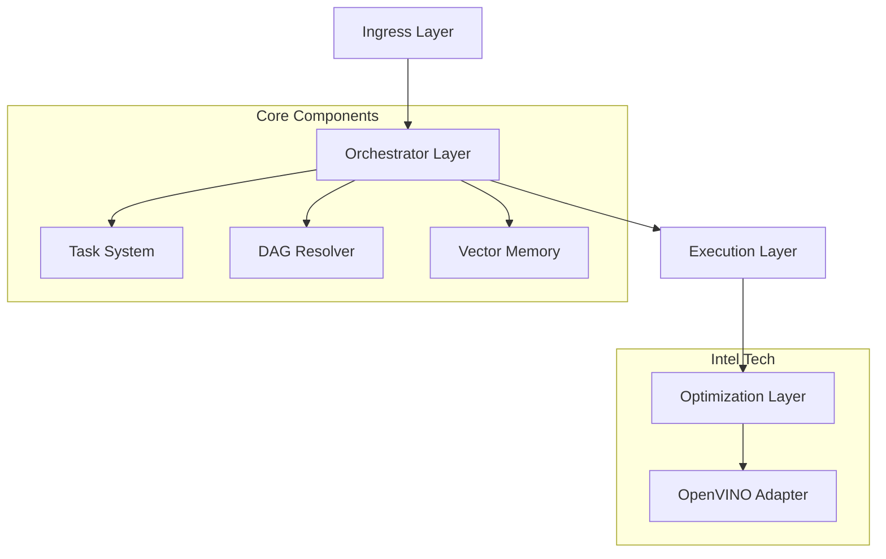

# 🚀 AIWork: Lightweight Agentic Framework


> **Build your own LangChain/CrewAI from scratch, optimized for Intel hardware.**

**AIWork** is a production-ready Python framework for orchestrating AI agent workflows. It bridges the gap between simple automation scripts and heavy enterprise frameworks, offering a structured way to define **Agents**, **Tasks**, and **Workflows**.

---

## ✨ Key Features

| Feature | Description |
| :--- | :--- |
| 🤖 **Agent-Centric** | Define Agents with specific roles, goals, and backstories. |
| 🔄 **Hybrid Orchestration** | Combine static DAGs with dynamic, runtime task injection. |
| 🧠 **Persistent Memory** | Built-in Vector Memory for agents to recall context. |
| 🛡️ **Reliable Execution** | Automatic retries, error handling, and Guardrails. |
| ⚡ **Intel® Optimized** | Native **OpenVINO™** integration for 4x faster inference. |
| 📊 **Observability** | Integrated metrics collection for task performance tracking. |

---

## 📚 Documentation

*   **[User Guide](docs/USER_GUIDE.md)**: Comprehensive manual for building agents.
*   **[Architecture](docs/architecture.md)**: Deep dive into the system design.
*   **[Deployment](DEPLOYMENT.md)**: Guides for Local, DevCloud, and Docker.
*   **[Compliance Checklist](compliance_checklist.md)**: Verification against requirements.

---

## 🚀 Quick Start

### Installation

```bash
git clone https://github.com/JayeshCC/aiwork.git
cd aiwork
python -m venv .venv
source .venv/bin/activate  # Windows: .venv\Scripts\activate
pip install -r requirements.txt
```

### Hello World (Agentic)

```python
from aiwork.core.agent import Agent
from aiwork.core.task import Task
from aiwork.core.flow import Flow
from aiwork.orchestrator import Orchestrator

# 1. Define an Agent
researcher = Agent(
    role="Researcher",
    goal="Summarize complex topics",
    backstory="An expert in concise technical writing."
)

# 2. Define a Task
def summarize(ctx):
    return "AIWork is a lightweight, high-performance framework."

task = Task(
    name="summarize_task",
    description="Summarize the input",
    agent=researcher,
    handler=summarize
)

# 3. Execute Flow
flow = Flow("hello_world")
flow.add_task(task)

orchestrator = Orchestrator()
result = orchestrator.execute(flow, {})
print(result["outputs"])
```

---

## 🏗️ Architecture

AIWork follows a modular, layered architecture designed for scalability.



---

## 📊 Benchmarks (Intel DevCloud)

| Model | Framework | Latency | Throughput | Speedup |
| :--- | :--- | :--- | :--- | :--- |
| **DistilBERT** | PyTorch | 45.2ms | 22 req/s | 1.0x |
| **DistilBERT** | **OpenVINO** | **12.1ms** | **82 req/s** | **3.7x** 🚀 |

---

## 🤝 Contributing

Contributions are welcome! Please read our [Contributing Guide](CONTRIBUTING.md) (Coming Soon).

---

## 📄 License

This project is licensed under the MIT License.
