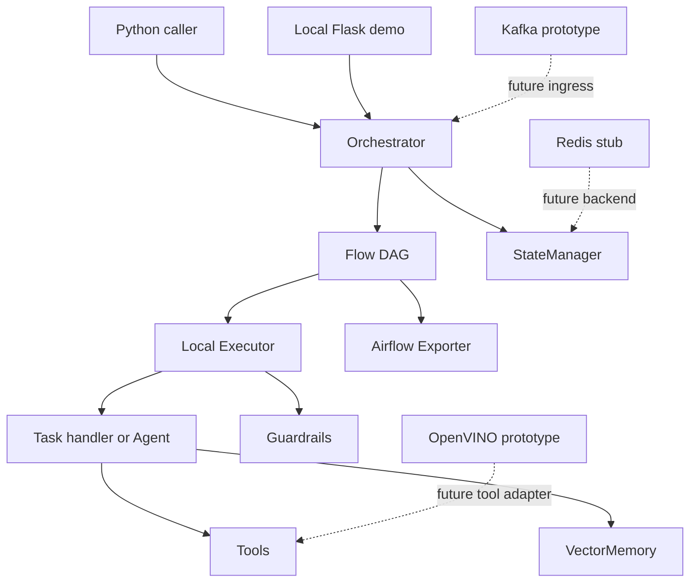

# AIWork Architecture

AIWork is a small alpha-stage framework for local agentic workflow experiments. Its architecture separates implemented core behavior from adapter boundaries that can be extended later.

## Component Map

```mermaid
graph TD
    A[Python caller] --> B[Orchestrator]
    C[Local Flask demo] --> B
    B --> D[Flow DAG]
    D --> E[Local Executor]
    E --> F[Task handler or Agent]
    F --> G[Tools]
    F --> H[VectorMemory]
    E --> I[Guardrails]
    B --> J[StateManager]
    D --> K[Airflow Exporter]
    L[Kafka prototype] -. future ingress .-> B
    M[Redis stub] -. future backend .-> J
    N[OpenVINO prototype] -. future tool adapter .-> G
```

## Implemented Core

### Flow DAG

`src/aiwork/core/flow.py` stores tasks and dependencies. `get_topological_sort()` validates dependency ordering and rejects cycles.

### Orchestrator

`src/aiwork/orchestrator.py` executes a flow through an executor, records workflow state, and maintains a local execution queue. When a handler returns a `next_tasks` list, those tasks are appended at runtime.

Dynamic task injection is implemented local queue behavior. It is not parallel or distributed scheduling.

### Tasks, Agents, and Tools

- `Task` is the executable work unit. It accepts a handler or an `Agent`.
- `Agent` stores role, goal, backstory, tools, optional memory, and an optional LLM.
- `ToolRegistry` stores reusable functions by name.
- `LocalExecutor` applies input and output guardrails and retry behavior.

### Memory and State

`VectorMemory` is a lightweight local memory implementation based on word-overlap similarity. It is suitable for demos and tests, not semantic retrieval claims.

`StateManager` tracks workflow and task state in memory. The Redis flag is a future backend boundary and does not connect to Redis.

## Local Demonstration API

`src/aiwork/api/server.py` exposes a Flask ingress demo:

- `GET /health`
- `POST /workflow`
- `GET /workflow/<id>`
- `GET /workflow/<id>/task/<name>`

Submitted JSON task definitions run generic handlers. State is ephemeral and work runs in daemon threads. The server demonstrates API shape and state reporting; it is not a production microservice.

## Adapter Architecture

### Airflow Exporter

`src/aiwork/integrations/airflow_exporter.py` writes an Airflow DAG file from a `Flow`. It preserves task names and dependencies, while generated Python callables are placeholders.

### Kafka Prototype

`src/aiwork/integrations/kafka_adapter.py` demonstrates a future messaging boundary. It prints produced messages and yields fixed mock tasks. It does not connect to a Kafka cluster.

### OpenVINO Prototype

`src/aiwork/integrations/openvino_adapter.py` demonstrates a future model-adapter boundary. It does not import the OpenVINO runtime, compile a model, run inference, or perform hardware acceleration.

### Redis Stub

`StateManager(use_redis=True)` marks a future persistence boundary. Distributed state is not implemented.

## Benchmark Boundary

`benchmarks/openvino_benchmark.py` compares functions that sleep for predefined durations. It is a simulated timing demonstration, not a hardware benchmark.

## Current Limitations

- execution is sequential
- state is local and ephemeral
- the Flask API is demo-only
- Kafka, Redis, and OpenVINO integration work is incomplete
- Airflow-exported callables are placeholders
- performance claims require future measured benchmarks

## Extension Priorities

See [ROADMAP.md](ROADMAP.md) for undated priorities and [MOCK_IMPLEMENTATIONS.md](MOCK_IMPLEMENTATIONS.md) for the component-by-component status inventory.
